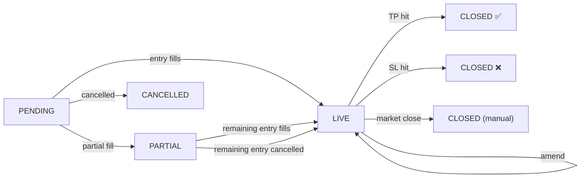

# Viridis — Bybit Execution Engine

A risk-first execution terminal for Bybit USDT perpetuals. Define your risk, and the engine handles position sizing, leverage, and bracket management — all through a single atomic API call.

## Core Concept

```
Input:   LONG BTC @ $74,300 | SL $73,300 | Risk $50

Engine:  SL distance   = $1,000 / $74,300 = 1.35%
         Safe leverage  = floor(1 / (1.35% + MMR + fees)) = 48x
         Qty            = $50 / ($1,000 + fees) ≈ 0.047 BTC   (risk is net of fees)
         Margin locked  = $3,492 / 48 = $72.75

Result:  If wrong → lose $50. If right → keep the profit.
```

Position size is derived from **risk**, not margin. Leverage is computed to keep liquidation behind your stop — never manually set.

## Features

- **Atomic OTOCO brackets** — Entry + TP (limit) + SL (market) in one API call via `tpslMode="Partial"`
- **Per-symbol MMR** — Real maintenance margin rates from Bybit's risk limit API, not hardcoded guesses
- **Strat1 trailing stop** — De-risking heuristic: tightens SL to half-distance at 75% of the way to TP, then to fee-adjusted breakeven at 90%. Survives restarts: trailing state is persisted in the risk ledger and re-armed on boot sync
- **Market close** — Reduce-only market exit for any live position (confirmation-gated), with a follow-up sweep that cancels orphaned TP/SL conditionals so a stale bracket can never fire on a future position
- **Honest connection status** — The status pill polls actual WebSocket state (private + ticker streams) and degrades visibly to the 30s REST fallback instead of claiming "live"
- **Live trade panel** — Real-time PnL, mark price, TP/SL, leverage, and progress-to-TP bar
- **Trade journal** — Mirrors Bybit's closed-PnL history (fee-inclusive, source of truth), so it captures every closed trade — even ones closed while the app was off. Session/lifetime stats, win rate, R-multiples (for app-placed trades), and expectancy, with a `history` pop-out ledger
- **Heatmap** — Account-level exposure as a percentage of equity
- **Live pre-trade price** — Typing a symbol subscribes its ticker: live last/bid/ask with click-to-fill entry, plus a warning (and optional post-only enforcement) when a limit entry would cross the book and fill as taker
- **Execution-stream truth** — Every fill is checked against the maker-entry assumption; taker fills are flagged with actual vs planned fees
- **Account-synced fee rates** — Maker/taker rates are pulled from Bybit at boot, so sizing tracks your real fee tier automatically
- **Exact R-multiple joins** — Closing order IDs are recorded as brackets fire, so journal stats can't mis-attribute risk when re-entering the same level (fuzzy price match remains only for external closes)
- **Margin mode control** — Toggle isolated/cross margin directly from the GUI
- **Instrument cache** — 670+ symbols cached to disk (24h TTL), with autocomplete search

## Architecture

```
Bybit/
├── config.py             .env loader → typed constants
├── cache_engine.py       Instrument + MMR cache (auto-paginated, 24h TTL)
├── trading_core.py       Risk math, OTOCO execution, WebSocket state machine, Strat1
├── journal.py            Exchange-mirrored trade journal (Bybit closed-PnL) + stats
├── main.py               PyQt6 terminal GUI
├── test_trade.py         CLI integration test harness
├── docs/                 Architecture & design guide (HTML, diagrams)
├── bybit_symbology.json  Auto-generated instrument cache
└── trade_journal.json    Permanent local trade archive
```

**Signal flow:** `TradingCore` (background threads) → `SignalBridge` (Qt signals) → `MainWindow` (main thread). All exchange I/O is non-blocking; all GUI updates go through signals.

## Documentation

A deeper, diagram-rich guide lives in [`docs/`](docs/index.html) — open `docs/index.html` in a browser:

- **[Architecture & design guide](docs/index.html)** — philosophy, the risk math (with worked examples), order execution, the concurrency model, trade lifecycle, and Strat1.
- **[How the journal stays complete](docs/journal-sync.html)** — why the local journal is a permanent archive and Bybit is only used to fetch the delta.

## Quick Start

```bash
cp .env.example .env          # Add your Bybit API key + secret
python3 -m venv .venv && source .venv/bin/activate
pip install -r requirements.txt
python main.py
```

## Trade Lifecycle



Bracket modifications use `amend_order` for existing child conditionals. `set_trading_stop` is only used to add a fresh paired `Partial` TP/SL with equal sizes.

## Design Decisions

| Decision | Rationale |
|---|---|
| `tpslMode="Partial"` | TP as limit order (not market). Matching engine handles OCO natively. Keeps multi-TP scale-out optionality. |
| Per-symbol MMR | BTC = 0.5%, altcoins can be 2%+. Prevents liquidation before SL. |
| 0.2% leverage cushion | Keeps liquidation behind your SL even after SL-fill slippage. |
| SL triggers on Mark Price | Liquidation always uses Mark Price; triggering the SL on the same reference guarantees the SL fires *before* liquidation. Configurable via `SL_TRIGGER_BY`. |
| Fee-aware risk sizing | "Risk" = your *net* loss when stopped (price move + round-trip fees), and it holds regardless of leverage. |
| Exchange-mirrored journal | Reconciled from Bybit closed-PnL, so it captures trades closed while the app was off; fees included; deduped by order ID. |
| TP trigger at midpoint | `(entry + tp) / 2` — triggers the limit TP order early enough for maker fill. |
| TP trigger on Last Price | A limit fill needs the *traded* market to reach the trigger; Mark can deviate exactly when it matters. (SL stays on Mark — see above.) |
| Cross-book warning, optional PostOnly | Sizing assumes a maker entry. Marketable limits stay possible — but deliberate, never accidental. The execution stream verifies the assumption after every fill. |
| Closing-orderId journal join | R-multiples join on the exact closing order ID (recorded as brackets fire); fuzzy entry-price match only for external closes. |
| Fee rates synced from account | `get_fee_rates` at boot overrides config, so sizing tracks the real fee tier without manual updates. |
