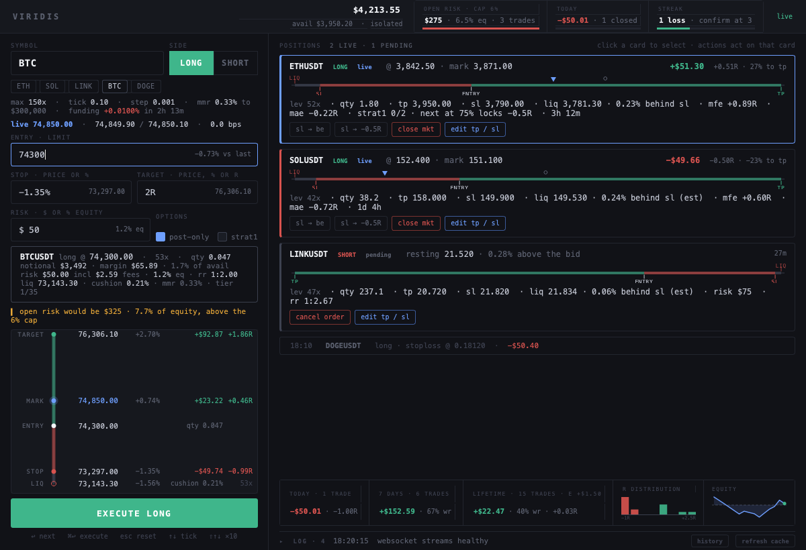

# Viridis

A desktop terminal for trading Bybit USDT perpetuals where the only number you decide is how much you are willing to lose.

You type an entry, a stop and a dollar risk. Viridis sizes the position, picks the leverage that keeps liquidation behind your stop, and sends the entry with its take-profit and stop-loss as one order. It then watches the trade, ratchets the stop if you ask it to, and journals the result with the exchange's own numbers.



*Ticket on the left, one card per open trade on the right, account-level risk in the top bar. Synthetic data.*

## Why it exists

Every exchange ticket asks for a size and a leverage. Neither is something you know. What you know is where you enter, where you are wrong, and what that mistake may cost you. The size follows from those three numbers once fees are included, and the leverage follows from the exchange's maintenance-margin rules. Viridis does that arithmetic on every keystroke and shows it on a price ladder, so the trade you see is the trade that gets sent.

## A trade, start to finish

1. **Fill the ticket.** Symbol, entry, a stop as a price or a distance (`-0.8%`), an optional target as a price, a percent (`+3%`) or a multiple of the stop distance (`2R`), and the risk in dollars or as a share of equity (`1%`). Arrow keys nudge prices by one tick.
2. **Read the preview.** It recomputes as you type: quantity, leverage, margin, fees, reward-to-risk, the estimated liquidation price and the cushion between it and your stop. Warnings appear ranked: amber ones ask for a confirmation, red ones block.
3. **Send.** ⌘Enter opens a confirm sheet with the same numbers and warnings. One API call places a limit entry carrying a limit take-profit and a market stop-loss that triggers on mark price. Post-only is on by default: a limit that would cross the book is cancelled instead of filling as taker.
4. **Manage.** The trade becomes a card: mark price, PnL in dollars and R, a mini ladder with the liquidation price, the best and worst the trade has been, and the buttons that matter: stop to break-even, stop to −0.5R, edit target or stop, cancel, close at market.
5. **Review.** When the trade closes, the journal takes Bybit's closed-PnL record, which is fee-inclusive, and attaches the R-multiple plus maximum favourable and adverse excursion. The strip at the bottom shows today, the last seven days and lifetime.

## The arithmetic, once

```
LONG BTC · entry 74,300 · stop 73,300 · risk $50

stop distance   1,000 / 74,300                      = 1.35 %
quantity        50 / (1,000 + fees per unit)        = 0.047 BTC     risk is net of fees
tier            $3,492 of notional sits in tier 1   → MMR 0.33 %, max 150x
leverage        floor(1 / (1.35 % + 0.33 % + 0.2 %)) = 53x
liquidation     74,300 × (1 − 1/53 + 0.33 %)        ≈ 73,143       0.21 % behind the stop
margin locked   3,492 / 53                          = $65.89
```

Leverage is a capital-efficiency knob, not a risk knob: the loss at the stop is $50 at 10x and at 53x. Once the position is live, the exchange's own liquidation price replaces the estimate, and the log shouts if it ever sits inside the stop.

## What keeps you out of trouble

- **Caps.** Risk above 2% of equity on one trade asks for a hard confirm. Open risk above 6% of equity after the trade asks for a confirm. A daily loss limit, if you set one, blocks new trades for the day. Three losses in a row add a warning.
- **Blocks.** Margin above available balance, a second trade on a symbol that already has one, and a breached daily limit disable the send button.
- **Tier-aware sizing.** Bybit raises the maintenance margin rate as position value grows. On most alts tier 1 ends at $5k–$20k of notional, so the base rate would put liquidation inside the stop. Viridis uses the tier the trade actually lands in.
- **Strat1.** An optional stop ratchet: at 75% of the way to the target the stop moves to −0.5R, at 90% to fee-adjusted break-even. The table is configurable, the stop never loosens, and it survives restarts.
- **Honest status.** The status pill reflects the real WebSocket state and falls back to REST polling every 30 seconds when a stream drops.

## Install and run

Python 3.10 or newer, a Bybit Unified Trading Account in one-way mode, and an API key with contract order and position permissions.

```bash
git clone https://github.com/seyeint/ViridisBybit.git && cd ViridisBybit
python3 -m venv .venv && source .venv/bin/activate
pip install -r requirements.txt
cp .env.example .env            # add BYBIT_API_KEY and BYBIT_API_SECRET
python -m unittest discover -s tests
python main.py
```

Set `BYBIT_TESTNET=true` in `.env` to run against testnet first; the window shows a badge when it is on. `python test_trade.py` prices a fixed trade through the engine, prints the exact order body, and fires only if you type `FIRE`.

| Key | Action |
|---|---|
| ↩ | Next field; from the risk field, send |
| ⌘↩ | Send from anywhere |
| ↑ ↓ | Nudge a price by one tick, ⇧ for ten; steps a % or R input |
| Esc | Reset the ticket |

## Configuration

Everything lives in `.env`. Defaults are sensible for a VIP0 account; the fee rates are replaced by your real tier at boot.

| Key | Default | What it does |
|---|---|---|
| `BYBIT_API_KEY`, `BYBIT_API_SECRET` | | Credentials |
| `BYBIT_TESTNET` | `false` | Use testnet |
| `DEFAULT_RISK_USD` | `100` | Seeds the risk field |
| `MAX_RISK_PCT` | `2.0` | Per-trade risk above this share of equity needs a hard confirm |
| `MAX_OPEN_RISK_PCT` | `6.0` | Open risk above this share of equity needs a confirm |
| `DAILY_LOSS_LIMIT_USD` | `0` | Realised loss today at which sending is disabled; 0 turns it off |
| `LOSS_STREAK_CONFIRM` | `3` | Consecutive losses at which a new trade warns; 0 turns it off |
| `STRAT1_RATCHET` | `0.75:-0.5,0.90:0` | Strat1 steps as `progress:lockR` pairs |
| `SL_TRIGGER_BY` | `MarkPrice` | Stop trigger reference; liquidation uses mark, so keep it |
| `FEE_MAKER_RATE`, `FEE_TAKER_RATE` | `0.0002`, `0.00055` | Fallback fee rates |
| `JOURNAL_BACKFILL_DAYS` | `30` | History pulled the first time the journal is empty |
| `RISK_LEDGER_MAX_AGE_DAYS` | `365` | Keep above your longest hold |

## How it is built

```
trading_core.py   the engine: risk math, order execution, stream handlers, Strat1,
                  risk ledger, journal reconciliation — the only file that talks to Bybit
cache_engine.py   instrument rules and risk-limit tiers, cached to disk for a day
journal.py        closed trades mirrored from the exchange, plus statistics
main.py           the window: ticket, board, governance strip, log drawer
views.py          trade card, journal dialog, text formatting
widgets.py        painted primitives: ladder, mini ladder, charts, hinted input
theme.py          palette and stylesheet
config.py         .env → typed constants
tests/            unit tests for the math, the ratchet and the reconciliation paths
docs/             a longer design guide with diagrams — open docs/index.html
```

The core runs on background threads and is the single writer of trade state. The window receives snapshots through Qt signals, renders them, and hands them back for actions. Three files on disk are yours and git-ignored: `bybit_symbology.json` (the cache), `trade_journal.json` (every closed trade, append-only) and `risk_ledger.json` (intended risk and Strat1 state per app-placed trade).

## Decisions worth knowing

| Decision | Why |
|---|---|
| Risk is net of fees | The loss at the stop includes the maker entry and the taker exit; a naive size overshoots by 7% at a 1% stop and 37% at a 0.2% stop. |
| Stop triggers on mark price | Liquidation is evaluated on mark. Triggering the stop on the same reference is what makes the cushion a guarantee. |
| Take-profit is a limit order triggered at the midpoint | It rests on the book before price arrives and fills as maker. |
| One bracket per order, `tpslMode="Partial"` | The exchange handles the one-cancels-other logic, and partial mode keeps scale-outs possible later. |
| Post-only by default | Sizing assumes a maker entry. A taker fill stays possible, but deliberate. |
| Journal mirrors the exchange | Trades closed while the app was off are still captured, and PnL is Bybit's fee-inclusive number rather than an estimate. |
| Account-level caps | Risk-first has to hold across trades, not only inside one. |

Not built yet: scaling out at several targets, and closing half a position. Both need the bracket resized in the same step and deserve their own design.

## Status

A personal tool that trades real money. It has unit tests for the arithmetic and the reconciliation paths and has been run against a live account, but there is no warranty of any kind. Read the code before you trust it with yours.
