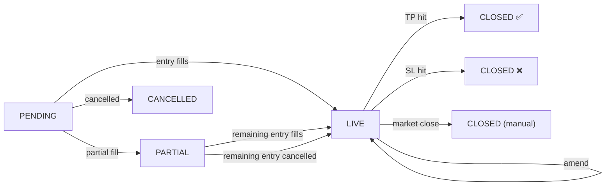

# Viridis — Bybit Execution Engine

A risk-first execution terminal for Bybit USDT perpetuals. Define your risk, and the engine handles position sizing, leverage, and bracket management — all through a single atomic API call.

## Core Concept

```
Input:   LONG BTC @ $74,300 | SL $73,300 | Risk $50

Engine:  SL distance   = $1,000 / $74,300 = 1.35%
         Safe leverage  = floor(1 / (1.35% + MMR + fees)) = 48x
         Qty            = $50 / ($1,000 + fees) ≈ 0.047 BTC   (risk is net of fees)
         Margin locked  = $3,492 / 48 = $72.75
         Liquidation    ≈ $73,124 — 0.23% behind the stop, and checked against
                          the exchange's own liqPrice once the position is live

Result:  If wrong → lose $50. If right → keep the profit.
```

Position size is derived from **risk**, not margin. Leverage is computed to keep liquidation behind your stop — never manually set — using the risk-limit tier the trade's notional actually lands in.

## The board

Ticket on the left, positions on the right, account-level risk in the top bar.

- **Live preview** — recomputes on every keystroke: leverage, quantity, notional, margin, fees, R:R, liquidation and cushion. Execute is never available without the numbers on screen, and warnings are ranked (amber confirms, red blocks).
- **Relative inputs** — the stop takes a price or a distance (`-0.8%`), the target a price, a percent (`+3%`) or an R multiple (`2R`), and risk dollars or a share of equity (`1%`). Arrow keys nudge by tick (shift ×10), Enter moves on, ⌘Enter executes, Esc resets.
- **Price ladder** — target, mark, entry, stop and liquidation on one scale with the distance, the dollars and the R at each level.
- **Position cards** — severity stripe, a mini ladder with liquidation and MFE, the cushion behind the stop, MFE/MAE in R, strat1 progress, and inline actions: stop to break-even, stop to −0.5R, close at market, cancel, edit TP/SL (relative syntax works here too).
- **Governance strip** — open risk in dollars and as a share of equity, today's realised PnL against a daily limit, and the loss streak. Caps are `.env` settings; a breached daily limit blocks new trades.
- **Stats strip + log drawer** — today, 7 days and lifetime with an R histogram and an equity curve; the log collapses to one line and opens itself on errors.

## Engine

- **Atomic OTOCO brackets** — Entry + TP (limit) + SL (market) in one API call via `tpslMode="Partial"`
- **Tier-aware MMR** — All risk-limit tiers are cached; sizing uses the maintenance margin rate and max leverage of the tier the notional lands in, so the liquidation cushion holds on alts where tier 1 ends at $5k–$20k
- **Liquidation check** — The exchange's `liqPrice` is tracked per position and compared to the stop; if it ever sits inside, the log shouts
- **Strat1 ratchet** — De-risking stop moves as price progresses toward the target, from a configurable table (`STRAT1_RATCHET`, default 75% → −0.5R, 90% → fee-adjusted break-even). Never loosens, never crosses the mark, survives restarts via the risk ledger
- **Fee-aware risk sizing** — "risk" is the net loss at the stop including round-trip fees
- **Honest connection status** — The status pill polls actual WebSocket state and degrades visibly to the 30s REST fallback
- **Execution-stream truth** — Every fill is checked against the maker-entry assumption; taker fills are flagged with actual vs planned fees
- **Account-synced fee rates** — Maker/taker rates are pulled from Bybit at boot
- **Trade journal** — Mirrors Bybit's closed-PnL history (fee-inclusive, source of truth), deduped by closing order ID, so it captures trades closed while the app was off. App-placed trades carry R, MFE and MAE
- **Margin mode control** — Toggle isolated/cross from the top bar (needs a flat account)
- **Instrument cache** — 700+ symbols cached to disk (24h TTL), with autocomplete search

## Architecture

```
Bybit/
├── config.py             .env loader → typed constants (fees, triggers, governance caps, ratchet)
├── cache_engine.py       Instrument + risk-limit tier cache (auto-paginated, 24h TTL)
├── trading_core.py       Risk math, OTOCO execution, WebSocket state machine, Strat1, ledger
├── journal.py            Exchange-mirrored trade journal (Bybit closed-PnL) + stats
├── theme.py              Palette + stylesheet
├── widgets.py            Painted widgets: ladder, mini ladder, charts, hinted inputs
├── main.py               PyQt6 board (ticket, cards, governance strip, drawer)
├── tests/                Unit tests for the pure math (python -m unittest discover -s tests)
├── test_trade.py         CLI integration test harness
├── docs/                 Architecture & design guide (HTML, diagrams)
├── bybit_symbology.json  Auto-generated instrument cache
└── trade_journal.json    Permanent local trade archive
```

**Signal flow:** `TradingCore` (background threads) → `SignalBridge` (Qt signals) → `MainWindow` (main thread). All exchange I/O is non-blocking; all GUI updates go through signals. The core is the single writer of trade state — the GUI holds snapshots and hands them back for actions.

## Documentation

A deeper, diagram-rich guide lives in [`docs/`](docs/index.html) — open `docs/index.html` in a browser:

- **[Architecture & design guide](docs/index.html)** — philosophy, the risk math (with worked examples), order execution, the concurrency model, trade lifecycle, Strat1, and the board.
- **[How the journal stays complete](docs/journal-sync.html)** — why the local journal is a permanent archive and Bybit is only used to fetch the delta.

## Quick Start

```bash
cp .env.example .env          # Add your Bybit API key + secret
python3 -m venv .venv && source .venv/bin/activate
pip install -r requirements.txt
python -m unittest discover -s tests
python main.py
```

## Trade Lifecycle


```mermaid
flowchart LR
    A["PENDING"] -->|entry fills| B["LIVE"]
    A -->|partial fill| P["PARTIAL"]
    P -->|remaining entry fills| B
    P -->|remaining entry cancelled| B
    A -->|cancelled| C["CANCELLED"]
    B -->|TP hit| D["CLOSED ✅"]
    B -->|SL hit| E["CLOSED ❌"]
    B -->|market close| F["CLOSED (manual)"]
    B -->|amend| B
```

Bracket modifications use `amend_order` for existing child conditionals. `set_trading_stop` is only used to add a fresh paired `Partial` TP/SL with equal sizes.

## Design Decisions

| Decision | Rationale |
|---|---|
| `tpslMode="Partial"` | TP as limit order (not market). Matching engine handles OCO natively. Keeps multi-TP scale-out optionality. |
| Tier-aware MMR | Bybit raises MMR with position value. On most alts tier 1 ends below a $100-risk trade's notional; the base rate would put liquidation inside the stop. |
| 0.2% leverage cushion | Keeps liquidation behind your SL even after SL-fill slippage; verified against the exchange's liqPrice once live. |
| SL triggers on Mark Price | Liquidation always uses Mark Price; triggering the SL on the same reference guarantees the SL fires *before* liquidation. Configurable via `SL_TRIGGER_BY`. |
| Fee-aware risk sizing | "Risk" = your *net* loss when stopped (price move + round-trip fees), and it holds regardless of leverage. |
| Account-level caps | Per-trade risk, open risk and a daily loss limit live in the top bar and gate execution — risk-first has to hold across trades, not just inside one. |
| Exchange-mirrored journal | Reconciled from Bybit closed-PnL, so it captures trades closed while the app was off; fees included; deduped by order ID; side taken from the closing order. |
| TP trigger at midpoint | `(entry + tp) / 2` — triggers the limit TP order early enough for maker fill. |
| TP trigger on Last Price | A limit fill needs the *traded* market to reach the trigger; Mark can deviate exactly when it matters. (SL stays on Mark — see above.) |
| Post-only by default | Sizing assumes a maker entry. A marketable limit stays possible — but deliberate, never accidental. The execution stream verifies the assumption after every fill. |
| Closing-orderId journal join | R-multiples join on the exact closing order ID (recorded as brackets fire); fuzzy entry-price match only for external closes. |
| Fee rates synced from account | `get_fee_rates` at boot overrides config, so sizing tracks the real fee tier without manual updates. |
